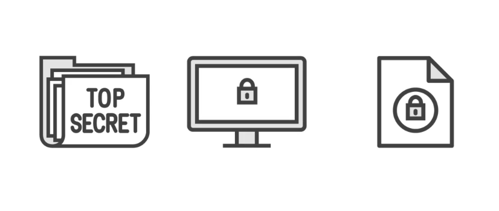
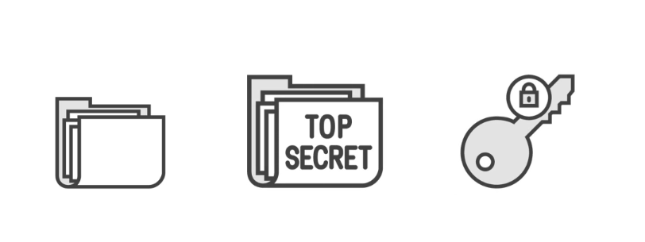
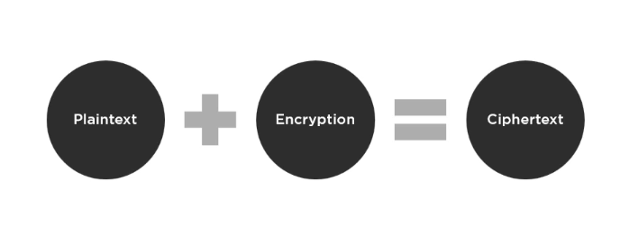
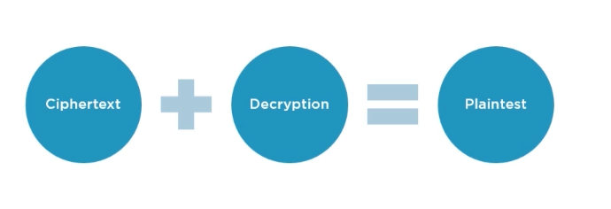

# Session 1

Understanding Crypto

## Subjects we're gonna cover

1. Understanding Crypto
2. Crypto Tools
3. PKI
4. Encrypting Email, Files, and Disk Drives
5. The Attacks Against Crypto
6. Your Countermeasures

## Understading Crypto

- The purpose of crpto
  trying to conceal the information (any data) by converting it using some type of key to make that data more secure.

  

  These data could be single file, individual files, or even your entire drive [securing workstation]
  

  - What Crypto Brings to the Table?
    ** Norepudiation: who ever has sent the message (because we can encrypto an Email for example) can't later deny having altered that document
    ** Integrity: we are sure that the actual data comes from the actual source that we are requesting it from
    ** Authentication: who we are, who we say we are (used on the web heavily and industry as whole)
    ** Confidetiality: we can only certain resources to authorized users

  - The process
    
    and we can do the vice versa
    

- Types of Crypto

1. Symmetric

2. Asymmetric

- Ciphers
- DES and AES
- Other Algorithms
- Standards and Protocols
- Hashes

## Crypto Tools

- MD5 Hash Calculators
- Crypto: Folders/Files
- Crypto: Drives
- Crypto: Mobile Devices
